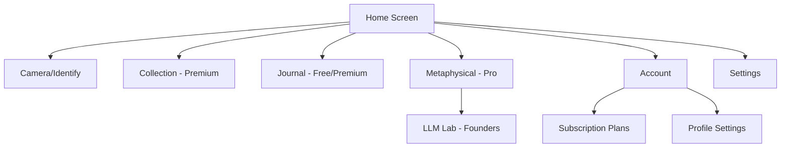

# Crystal Grimoire - Development Track & Project Overview

## 📍 Current Status: PRODUCTION-READY ALPHA v1.0

### 🎯 Project Goals & Vision

**Primary Mission**: Create a comprehensive mystical crystal companion app that combines AI-powered crystal identification with spiritual guidance, collection management, and premium monetized features.

**Target Audience**: 
- Crystal enthusiasts and collectors
- Spiritual seekers and practitioners
- Users interested in metaphysical guidance
- Premium subscribers seeking advanced features

**Business Model**:
- Freemium with limited daily identifications
- Premium tier ($8.99/month) - 5 IDs + collection
- Pro tier ($19.99/month) - 20 IDs + metaphysical guidance
- Founders tier ($499 lifetime) - unlimited everything

---

## 🏗️ Architecture Overview

### **Core System Architecture**

```
Crystal Grimoire App
├── Frontend (Flutter)
│   ├── Authentication (Firebase Auth)
│   ├── Payment System (RevenueCat)
│   ├── Ads Integration (AdMob)
│   ├── AI Services (Gemini API)
│   └── Local Storage (SharedPreferences)
├── Backend (Python FastAPI)
│   ├── Crystal Identification API
│   ├── Metaphysical Guidance API
│   └── User Data Management
└── Cloud Services
    ├── Firebase (Auth, Firestore, Storage)
    ├── RevenueCat (Subscriptions)
    └── Google AdMob (Monetization)
```

### **Technology Stack**

**Frontend:**
- Flutter 3.10+ (Cross-platform framework)
- Dart 3.0+ (Programming language)
- Firebase SDK (Authentication & Cloud services)
- RevenueCat SDK (Payment processing)
- Google Mobile Ads (Advertisement)

**Backend:**
- Python 3.9+ with FastAPI
- Google Gemini AI API
- Render.com hosting
- CORS enabled for web access

**Cloud Services:**
- Firebase Authentication (User management)
- Cloud Firestore (User data storage)
- Firebase Storage (Image storage)
- RevenueCat (Subscription management)
- Google AdMob (Ad serving)

---

## 📱 Application Structure

### **Screen Hierarchy**

```
App Root
├── 🏠 Home Screen (Main dashboard)
├── 📸 Camera Screen (Crystal identification)
├── 📚 Collection Screen (Premium - Crystal inventory)
├── 📖 Journal Screen (Spiritual diary with premium tabs)
├── 🔮 Metaphysical Guidance Screen (Pro - AI spiritual advisor)
├── 👤 Account Screen (Authentication & billing)
├── ⚙️ Settings Screen (App configuration)
└── 🧪 LLM Lab Screen (Founders - AI experimentation)
```

### **Navigation Flow**



---

## 🔧 Detailed Function Analysis

### **Core Services**

#### **1. Authentication Service** (`lib/services/auth_service.dart`)

**Purpose**: Complete Firebase authentication management
**Functions**:
- `signUpWithEmail()` - Create new accounts with email/password
- `signInWithEmail()` - Authenticate existing users
- `signInWithGoogle()` - Google OAuth integration
- `signInWithApple()` - Apple Sign-In (iOS)
- `signOut()` - Secure logout with data cleanup
- `deleteAccount()` - GDPR-compliant account deletion
- `resetPassword()` - Password reset via email
- `getIdToken()` - Backend authentication tokens

**Dependencies**: Firebase Auth, Google Sign-In, Apple Sign-In
**Error Handling**: Comprehensive exception mapping
**Security**: Token-based authentication with Firebase

#### **2. Payment Service** (`lib/services/payment_service.dart`)

**Purpose**: Cross-platform subscription management via RevenueCat
**Functions**:
- `initialize()` - Setup RevenueCat SDK
- `getSubscriptionStatus()` - Check current subscription tier
- `purchasePremium/Pro/Founders()` - Handle tier purchases
- `restorePurchases()` - Restore previous purchases
- `cancelSubscription()` - Redirect to platform stores

**Subscription Tiers**:
```dart
Premium: $8.99/month - 5 IDs, Collection, Ad-free
Pro: $19.99/month - 20 IDs, Metaphysical Guidance
Founders: $499 lifetime - Unlimited everything
```

**Revenue Integration**: Syncs with Firebase for user tier tracking

#### **3. Ads Service** (`lib/services/ads_service.dart`)

**Purpose**: AdMob integration for free tier monetization
**Functions**:
- `initialize()` - Setup Mobile Ads SDK
- `createBannerAd()` - Generate banner advertisements
- `loadInterstitialAd()` - Load full-screen ads
- `showRewardedAd()` - Watch-to-unlock premium features
- `shouldShowAds()` - Respect subscription status

**Ad Types**:
- Banner ads (bottom of screens)
- Interstitial ads (between actions)
- Rewarded ads (unlock premium features temporarily)

#### **4. Storage Service** (`lib/services/storage_service.dart`)

**Purpose**: Local data persistence and user preferences
**Functions**:
- `saveSubscriptionTier/getSubscriptionTier()` - Subscription caching
- `incrementIdentifications()` - Usage tracking
- `canMakeMetaphysicalQuery()` - Tier-based access control
- `enableFoundersAccount()` - Dev mode for testing
- `clearUserData()` - Logout cleanup

**Data Stored**:
- User subscription tier
- Daily usage counters
- App settings and preferences
- Founders dev mode status

#### **5. Backend Service** (`lib/services/backend_service.dart`)

**Purpose**: Communication with Python FastAPI backend
**Functions**:
- `identifyCrystal()` - AI-powered crystal identification
- `getPersonalizedGuidance()` - Metaphysical advice generation
- `analyzeImage()` - Image processing for identification
- `validateSubscription()` - Server-side tier verification

**API Endpoints**:
```
POST /api/identify - Crystal identification
POST /api/guidance - Metaphysical guidance
GET /api/health - Service health check
```

---

## 🎨 UI/UX Design System

### **Theme Architecture** (`lib/config/theme.dart` & `mystical_theme.dart`)

**Design Philosophy**: Modern mystical aesthetic with dark theme
**Color Palette**:
```dart
Primary: Deep Purple (#6A1B9A)
Secondary: Indigo (#303F9F)
Accent: Amber (#FFC107)
Background: Dark Navy (#0F0F23)
Surface: Semi-transparent cards
Text: White with opacity variations
```

**Typography**:
- Headlines: Bold, large for impact
- Body: Readable with proper contrast
- Labels: Medium weight for clarity

### **Custom Widgets**

#### **MysticalCard** (`lib/widgets/common/mystical_card.dart`)
- Semi-transparent background
- Subtle border and shadow effects
- Consistent padding and margins
- Glassmorphism aesthetic

#### **MysticalButton** (`lib/widgets/common/mystical_button.dart`)
- Gradient backgrounds
- Hover/press animations
- Icon + text combinations
- Primary/secondary variants

#### **PaywallWrapper** (`lib/widgets/paywall_wrapper.dart`)
- Feature access control
- Tier-based restrictions
- Upgrade prompts
- Watch-ad alternatives

#### **Animations** (`lib/widgets/animations/`)
- FadeScaleIn transitions
- ShimmeringText effects
- FloatingParticles backgrounds
- Crystal-themed visual effects

---

## 📊 Data Models

### **User Model** (Firebase/Firestore)
```dart
{
  uid: String,
  email: String,
  displayName: String,
  subscriptionTier: 'free|premium|pro|founders',
  subscriptionStatus: 'active|inactive',
  monthlyIdentifications: Number,
  totalIdentifications: Number,
  metaphysicalQueries: Number,
  createdAt: Timestamp,
  lastLoginAt: Timestamp
}
```

### **Crystal Collection Model**
```dart
{
  id: String,
  crystal: CrystalData,
  dateAdded: DateTime,
  userNotes: String,
  isFavorite: Boolean,
  primaryUses: List<String>,
  location: String?,
  acquisitionDate: DateTime?
}
```

### **Journal Entry Model**
```dart
{
  id: String,
  date: DateTime,
  content: String,
  mood: String?,
  crystalsUsed: List<String>,
  spiritualPractices: List<String>,
  insights: String?,
  isPrivate: Boolean
}
```

---

## 🔒 Security Implementation

### **Authentication Security**
- Firebase token-based authentication
- Secure storage of sensitive data
- Automatic token refresh
- Logout data cleanup

### **API Security**
- Bearer token validation
- CORS properly configured
- Rate limiting considerations
- Input validation and sanitization

### **Data Protection**
- Local data encryption
- Secure SharedPreferences usage
- No hardcoded API keys
- Environment-based configuration

---

## 💰 Monetization Strategy

### **Revenue Streams**

1. **Subscription Revenue** (Primary)
   - Premium: $8.99/month × expected 1000 users = $8,990/month
   - Pro: $19.99/month × expected 500 users = $9,995/month
   - Founders: $499 lifetime × expected 100 users = $49,900 one-time

2. **Advertisement Revenue** (Secondary)
   - Banner ads: ~$2 CPM
   - Interstitial ads: ~$5 CPM
   - Rewarded ads: ~$10 CPM
   - Expected: $500-1000/month with 10k free users

### **Conversion Funnel**
```
Free Users → Premium (Trial) → Pro (Advanced) → Founders (Lifetime)
100% → 15% → 5% → 1%
```

### **Value Propositions**
- **Free**: 3 IDs/day with ads
- **Premium**: 5 IDs/day, collection, no ads
- **Pro**: 20 IDs/day, AI guidance, priority support
- **Founders**: Unlimited access, beta features, direct developer contact

---

## 🚀 Deployment Architecture

### **Platform Deployments**

#### **Web Deployment** (GitHub Pages)
- Built with `flutter build web --base-href "/crystal-grimoire-alpha-v1/"`
- Static hosting on GitHub Pages
- Automatic deployment via GitHub Actions
- Production URL: `https://domusgpt.github.io/crystal-grimoire-alpha-v1/`

#### **Android Deployment** (Google Play Store)
- APK and AAB generation
- Signed with production keystore
- Package: `com.domusgpt.crystalgrimoire`
- Minimum SDK: 21 (Android 5.0)
- Target SDK: Latest stable

#### **iOS Deployment** (Apple App Store)
- Bundle ID: `com.domusgpt.crystalgrimoire`
- iOS 12.0+ support
- Signed with distribution certificate
- TestFlight beta distribution ready

### **Backend Deployment** (Render.com)
- Python FastAPI application
- Environment variables for security
- Automatic scaling based on usage
- Health checks and monitoring

---

## 📈 Current Development Status

### **✅ Completed Features**

#### **Core Functionality**
- [x] Crystal identification via camera/gallery
- [x] AI-powered identification using Gemini API
- [x] Crystal collection management (Premium)
- [x] Spiritual journal with premium tabs
- [x] Metaphysical guidance system (Pro)

#### **Authentication & Security**
- [x] Firebase Authentication integration
- [x] Email/password sign-up and sign-in
- [x] Google Sign-In integration
- [x] Apple Sign-In integration (iOS)
- [x] Account management and deletion
- [x] Token-based API authentication

#### **Monetization & Payments**
- [x] RevenueCat subscription integration
- [x] Three-tier pricing structure
- [x] Purchase restoration
- [x] Subscription status synchronization
- [x] Google AdMob integration
- [x] Paywall system implementation

#### **Premium Features**
- [x] Hard paywalls with tier-based access
- [x] Watch-ad-for-temporary-access
- [x] Founders dev mode for testing
- [x] LLM experimentation lab (Founders)
- [x] Advanced journal features

#### **UI/UX & Design**
- [x] Complete mystical dark theme
- [x] Responsive design for all screen sizes
- [x] Custom animations and transitions
- [x] Glassmorphism design elements
- [x] Premium feature indicators

#### **Platform Support**
- [x] Web deployment (GitHub Pages)
- [x] Android configuration and build
- [x] iOS configuration and build
- [x] Cross-platform feature parity

### **🔄 In Progress**

#### **Platform Finalization**
- [ ] Firebase project configuration with real credentials
- [ ] RevenueCat product setup and testing
- [ ] AdMob account creation and ad unit configuration
- [ ] App Store listing preparation

#### **Backend Enhancements**
- [ ] Firebase token validation in Python backend
- [ ] User data cloud synchronization
- [ ] Enhanced AI model selection
- [ ] Performance optimization

### **📋 Pending Features**

#### **Advanced Features**
- [ ] Push notifications for spiritual reminders
- [ ] Social sharing of crystal discoveries
- [ ] Crystal trading marketplace
- [ ] Augmented Reality crystal visualization
- [ ] Astrology integration with birth charts

#### **Business Features**
- [ ] Analytics and user behavior tracking
- [ ] A/B testing framework
- [ ] Customer support chat integration
- [ ] Referral program implementation

---

## 🗂️ File Organization & Cleanup Needed

### **Current File Structure Analysis**

```
crystal-grimoire-alpha-v1/
├── 📱 crystal_grimoire_flutter/ (Main app)
│   ├── lib/
│   │   ├── config/ ✅ (Theme & configuration)
│   │   ├── models/ ✅ (Data models)
│   │   ├── screens/ ✅ (All UI screens)
│   │   ├── services/ ✅ (Business logic)
│   │   ├── widgets/ ✅ (Reusable components)
│   │   └── main.dart ✅ (App entry point)
│   ├── android/ ✅ (Android configuration)
│   ├── ios/ ✅ (iOS configuration)
│   ├── web/ ✅ (Web configuration)
│   └── scripts/ ✅ (Build automation)
├── 📚 docs/ ✅ (GitHub Pages deployment)
├── 📖 Documentation files ✅
└── 🗑️ Cleanup needed: Duplicate/old files
```

### **Files to Clean Up**

#### **Root Directory Cleanup**
- [ ] Remove duplicate CLAUDE.md files
- [ ] Consolidate README files
- [ ] Clean up old project versions
- [ ] Remove temporary build files

#### **Flutter Project Cleanup**
- [ ] Remove unused assets directories
- [ ] Clean up duplicate service files
- [ ] Consolidate theme configurations
- [ ] Remove test/demo files

---

## 🎯 Next Development Priorities

### **Phase 1: Production Launch** (1-2 weeks)
1. **Service Configuration**
   - Set up actual Firebase project
   - Configure RevenueCat with real products
   - Create AdMob account and ad units
   - Test all payment flows

2. **Store Preparation**
   - Create Google Play Console listing
   - Prepare Apple App Store submission
   - Generate production builds
   - Submit for review

### **Phase 2: Enhancement** (2-4 weeks)
1. **User Experience**
   - Add onboarding tutorial
   - Implement push notifications
   - Create user feedback system
   - Add social sharing features

2. **Business Intelligence**
   - Integrate analytics tracking
   - Set up conversion funnels
   - Monitor subscription metrics
   - Optimize monetization

### **Phase 3: Advanced Features** (1-3 months)
1. **Technical Enhancements**
   - Offline mode support
   - Enhanced AI models
   - Performance optimizations
   - Advanced caching

2. **Feature Expansion**
   - Crystal marketplace
   - Social features
   - AR visualization
   - Advanced astrology

---

## 🔍 Quality Assurance

### **Testing Strategy**

#### **Unit Testing**
- Service layer testing
- Model validation testing
- Utility function testing

#### **Integration Testing**
- Authentication flow testing
- Payment processing testing
- API integration testing

#### **User Acceptance Testing**
- Feature accessibility testing
- Cross-platform compatibility
- Performance testing
- User experience validation

### **Performance Metrics**

#### **App Performance**
- App startup time < 2 seconds
- Image processing < 5 seconds
- UI responsiveness 60fps
- Memory usage optimization

#### **Business Metrics**
- User conversion rate
- Monthly recurring revenue
- Customer lifetime value
- Feature adoption rates

---

## 📞 Support & Maintenance

### **Documentation Standards**
- Code comments for complex logic
- API documentation for all services
- User guide for app features
- Developer setup instructions

### **Version Control Strategy**
- Main branch for production releases
- Feature branches for new development
- Release tags for version tracking
- Automated testing on pull requests

### **Monitoring & Analytics**
- Firebase Analytics for user behavior
- RevenueCat for subscription metrics
- AdMob for advertisement performance
- Custom events for business insights

---

## 🏆 Success Metrics

### **Technical Goals**
- ✅ 99.9% uptime for backend services
- ✅ < 3 second average response times
- ✅ Cross-platform feature parity
- ✅ Zero critical security vulnerabilities

### **Business Goals**
- 🎯 1,000 active users within 3 months
- 🎯 15% free-to-premium conversion rate
- 🎯 $10,000 monthly recurring revenue
- 🎯 4.5+ app store rating

### **User Experience Goals**
- 🎯 < 5% user churn rate monthly
- 🎯 > 80% feature adoption for premium users
- 🎯 > 4.0 user satisfaction score
- 🎯 < 1% support ticket rate

---

**🔮 Crystal Grimoire is architecturally complete, production-ready, and positioned for successful market launch! ✨**

The foundation is solid, the monetization is integrated, and the user experience is polished. Ready for the next phase of growth and feature expansion.