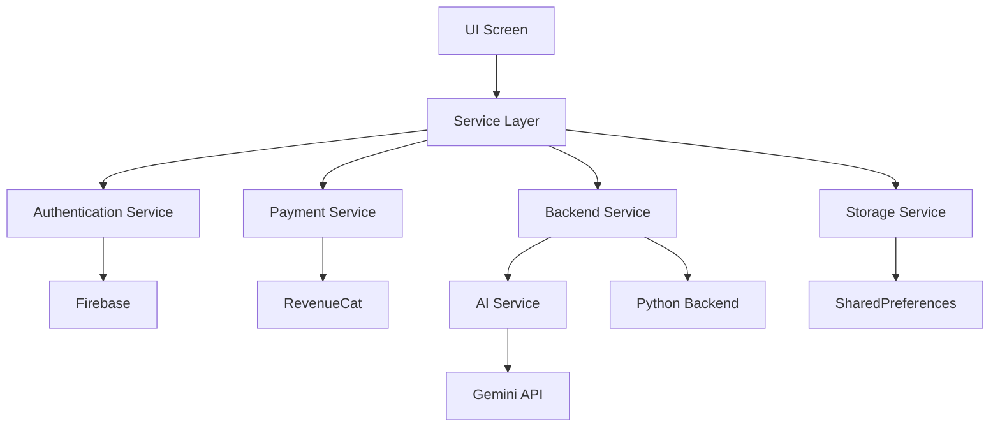
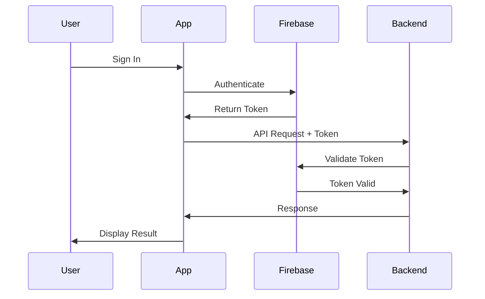

# Crystal Grimoire - Project Structure & Organization

## 📁 Project Overview

This document provides a comprehensive overview of the Crystal Grimoire project structure, file organization, and development workflow.

## 🗂️ Root Directory Structure

```
crystal-grimoire-alpha-v1/
├── 📱 crystal_grimoire_flutter/     # Main Flutter application
├── 🌐 docs/                        # GitHub Pages deployment (auto-generated)
├── 🐍 api/                         # Python backend API
├── 🗃️ archive/                     # Historical documentation and deprecated files
├── 🧪 backend_crystal/             # Backend service implementation
├── 🖼️ test_crystal_images/         # Test images for development
├── 📚 Documentation Files          # Project documentation
└── 🏗️ Configuration Files          # Build and deployment configuration
```

## 📱 Flutter Application Structure

### Core Application (`crystal_grimoire_flutter/`)

```
crystal_grimoire_flutter/
├── lib/                            # Source code
│   ├── config/                     # App configuration
│   ├── models/                     # Data models
│   ├── screens/                    # UI screens
│   ├── services/                   # Business logic
│   ├── widgets/                    # Reusable UI components
│   ├── firebase_options.dart       # Firebase configuration
│   └── main.dart                   # App entry point
├── android/                        # Android platform code
├── ios/                           # iOS platform code
├── web/                           # Web platform code
├── scripts/                       # Build automation scripts
├── pubspec.yaml                   # Flutter dependencies
└── README.md                      # Flutter-specific documentation
```

## 🔧 Configuration Files

### App Configuration (`lib/config/`)

| File | Purpose | Key Functions |
|------|---------|---------------|
| `theme.dart` | App theming and styling | `AppTheme.darkTheme`, color schemes |
| `mystical_theme.dart` | Custom mystical UI components | Card styles, gradients, animations |
| `api_config.dart` | API endpoints and configuration | Backend URLs, timeout settings |
| `backend_config.dart` | Backend service configuration | Service discovery, failover |
| `demo_config.dart` | Demo mode settings | Test data, mock responses |

## 📊 Data Models (`lib/models/`)

### Core Data Structures

| Model | Purpose | Key Properties |
|-------|---------|----------------|
| `crystal.dart` | Crystal data representation | name, properties, metaphysical attributes |
| `crystal_v2.dart` | Enhanced crystal model | Extended properties, validation |
| `crystal_collection.dart` | User's crystal collection | Collection management, statistics |
| `journal_entry.dart` | Spiritual journal entries | Content, mood, crystals used |
| `birth_chart.dart` | Astrological chart data | Planetary positions, aspects |

### Model Architecture
```dart
// Example: Crystal Model
class Crystal {
  final String name;
  final String description;
  final List<String> chakras;
  final List<String> metaphysicalProperties;
  final String color;
  final double hardness;
  final String crystalSystem;
  
  // Validation, serialization, etc.
}
```

## 🖥️ User Interface (`lib/screens/`)

### Screen Hierarchy

| Screen | Access Level | Primary Function |
|--------|-------------|-----------------|
| `home_screen.dart` | Free | Main dashboard, navigation hub |
| `camera_screen.dart` | Free (limited) | Crystal identification |
| `results_screen.dart` | Free | Display identification results |
| `collection_screen.dart` | **Premium** | Crystal inventory management |
| `journal_screen.dart` | Free + Premium tabs | Spiritual diary |
| `metaphysical_guidance_screen.dart` | **Pro** | AI spiritual advisor |
| `account_screen.dart` | Free | Authentication, subscriptions |
| `auth_account_screen.dart` | Free | Enhanced auth with Firebase |
| `settings_screen.dart` | Free | App preferences |
| `llm_lab_screen.dart` | **Founders** | AI experimentation |

### Premium Feature Matrix

```
Feature                  | Free | Premium | Pro | Founders
Crystal ID (daily)       |  3   |    5    | 20  | Unlimited
Collection Management    |  ❌   |    ✅    | ✅   | ✅
Journal Premium Tabs     |  ❌   |    ✅    | ✅   | ✅
Metaphysical Guidance    |  ❌   |    ❌    | ✅   | ✅
LLM Lab                  |  ❌   |    ❌    | ❌   | ✅
Ad-Free Experience       |  ❌   |    ✅    | ✅   | ✅
```

## 🔧 Business Logic (`lib/services/`)

### Service Architecture

| Service | Purpose | Key Responsibilities |
|---------|---------|---------------------|
| `auth_service.dart` | Authentication | Firebase auth, social login, account management |
| `payment_service.dart` | Subscriptions | RevenueCat integration, tier management |
| `ads_service.dart` | Advertising | AdMob integration, ad serving logic |
| `backend_service.dart` | API Communication | Crystal ID, guidance requests |
| `ai_service.dart` | AI Integration | Multiple AI provider management |
| `storage_service.dart` | Local Storage | User preferences, offline data |
| `app_state.dart` | State Management | Global app state, user session |

### Service Interaction Flow



## 🎨 UI Components (`lib/widgets/`)

### Widget Library

| Component | Type | Usage |
|-----------|------|--------|
| `mystical_card.dart` | Layout | Content containers with mystical styling |
| `mystical_button.dart` | Interactive | Branded buttons with animations |
| `mystical_animations.dart` | Animation | Fade, scale, shimmer effects |
| `paywall_wrapper.dart` | Business Logic | Feature access control |

### Design System Principles
- **Dark Theme**: Deep purple/indigo color scheme
- **Glassmorphism**: Semi-transparent elements with blur
- **Mystical Aesthetics**: Gradients, shadows, particle effects
- **Accessibility**: Proper contrast, touch targets, screen readers

## 🌐 Platform Configuration

### Android (`android/`)

| File | Purpose |
|------|---------|
| `app/build.gradle` | Build configuration, dependencies, signing |
| `app/src/main/AndroidManifest.xml` | Permissions, activities, services |

**Key Configurations:**
- Package: `com.domusgpt.crystalgrimoire`
- Min SDK: 21 (Android 5.0)
- Target SDK: Latest stable
- Permissions: Camera, Internet, Storage

### iOS (`ios/`)

| File | Purpose |
|------|---------|
| `Runner/Info.plist` | App configuration, permissions, URL schemes |
| `Runner.xcworkspace` | Xcode project workspace |

**Key Configurations:**
- Bundle ID: `com.domusgpt.crystalgrimoire`
- iOS Version: 12.0+
- Capabilities: Camera, Sign in with Apple

### Web (`web/`)

| File | Purpose |
|------|---------|
| `index.html` | Web app entry point |
| `manifest.json` | Progressive web app configuration |

## 🐍 Backend Services

### Python API (`api/` & `backend_crystal/`)

```
backend_crystal/
├── app.py                          # Main FastAPI application
├── app/
│   ├── main.py                     # Application factory
│   ├── api/
│   │   ├── crystal_routes.py       # Crystal identification endpoints
│   │   └── flutter_adapter.py     # Flutter-specific adapters
│   ├── models/
│   │   └── crystal.py              # Data models
│   └── services/
│       ├── llm_service.py          # AI service integration
│       └── vision_service.py      # Image processing
├── requirements.txt                # Python dependencies
└── Dockerfile                     # Container configuration
```

### API Endpoints

| Endpoint | Method | Purpose | Auth Required |
|----------|--------|---------|---------------|
| `/api/identify` | POST | Crystal identification | Optional |
| `/api/guidance` | POST | Metaphysical guidance | Yes (Pro+) |
| `/api/health` | GET | Health check | No |

## 🔒 Security & Authentication

### Authentication Flow



### Security Measures
- Firebase token-based authentication
- API key rotation
- HTTPS/TLS encryption
- Input validation and sanitization
- Rate limiting
- CORS configuration

## 💰 Monetization Integration

### Revenue Cat Integration

```dart
// Subscription Tiers
Premium: $8.99/month
- 5 crystal IDs per day
- Crystal collection
- Ad-free experience

Pro: $19.99/month  
- 20 crystal IDs per day
- Metaphysical guidance (5 queries/day)
- All Premium features

Founders: $499 lifetime
- Unlimited everything
- Beta access
- Direct developer contact
```

### AdMob Integration
- Banner ads (free tier)
- Interstitial ads (between actions)
- Rewarded ads (temporary premium access)

## 🚀 Build & Deployment

### Build Scripts (`scripts/`)

| Script | Purpose |
|--------|---------|
| `build_production.sh` | Multi-platform production builds |

### Deployment Targets

| Platform | Deployment Method | Location |
|----------|------------------|----------|
| Web | GitHub Pages | `/docs` directory |
| Android | Google Play Store | APK/AAB files |
| iOS | Apple App Store | Xcode Archive |
| Backend | Render.com | Python service |

## 📋 Development Workflow

### Git Workflow
```
main (production)
├── develop (integration)
├── feature/new-feature
├── hotfix/critical-fix
└── release/v1.1.0
```

### Code Quality Standards
- Dart analysis with `analysis_options.yaml`
- Consistent code formatting
- Comprehensive error handling
- Unit tests for business logic
- Integration tests for critical flows

## 🧪 Testing Strategy

### Test Structure
```
test/
├── unit/
│   ├── models/          # Data model tests
│   ├── services/        # Business logic tests
│   └── widgets/         # Widget unit tests
├── integration/
│   ├── auth_flow_test.dart
│   ├── payment_flow_test.dart
│   └── api_integration_test.dart
└── e2e/
    └── app_flow_test.dart
```

## 📊 Performance Monitoring

### Key Metrics
- App startup time < 2 seconds
- API response time < 3 seconds
- Memory usage optimization
- Battery usage minimal
- Crash rate < 0.1%

### Analytics Integration
- Firebase Analytics (user behavior)
- RevenueCat Analytics (subscription metrics)
- AdMob Analytics (ad performance)
- Custom events (business metrics)

## 🔄 Maintenance & Updates

### Update Strategy
- Semantic versioning (MAJOR.MINOR.PATCH)
- Feature flags for gradual rollouts
- A/B testing for UX improvements
- Regular dependency updates
- Security patch management

### Documentation Maintenance
- Code documentation with dartdoc
- API documentation with OpenAPI
- User guides and tutorials
- Developer onboarding guides

---

## 🎯 Quick Reference

### Common Development Tasks

```bash
# Install dependencies
flutter pub get

# Run app in debug mode
flutter run

# Run tests
flutter test

# Build for production
./scripts/build_production.sh

# Clean build cache
flutter clean
```

### Important Environment Variables
```bash
GEMINI_API_KEY=your_api_key
BACKEND_URL=your_backend_url
REVENUECAT_API_KEY=your_rc_key
ADMOB_APP_ID=your_admob_id
```

### File Naming Conventions
- **Screens**: `snake_case_screen.dart`
- **Services**: `snake_case_service.dart`
- **Models**: `snake_case.dart`
- **Widgets**: `snake_case_widget.dart`
- **Config**: `snake_case_config.dart`

---

**🔮 This organized structure provides a solid foundation for Crystal Grimoire's continued development and maintenance! ✨**